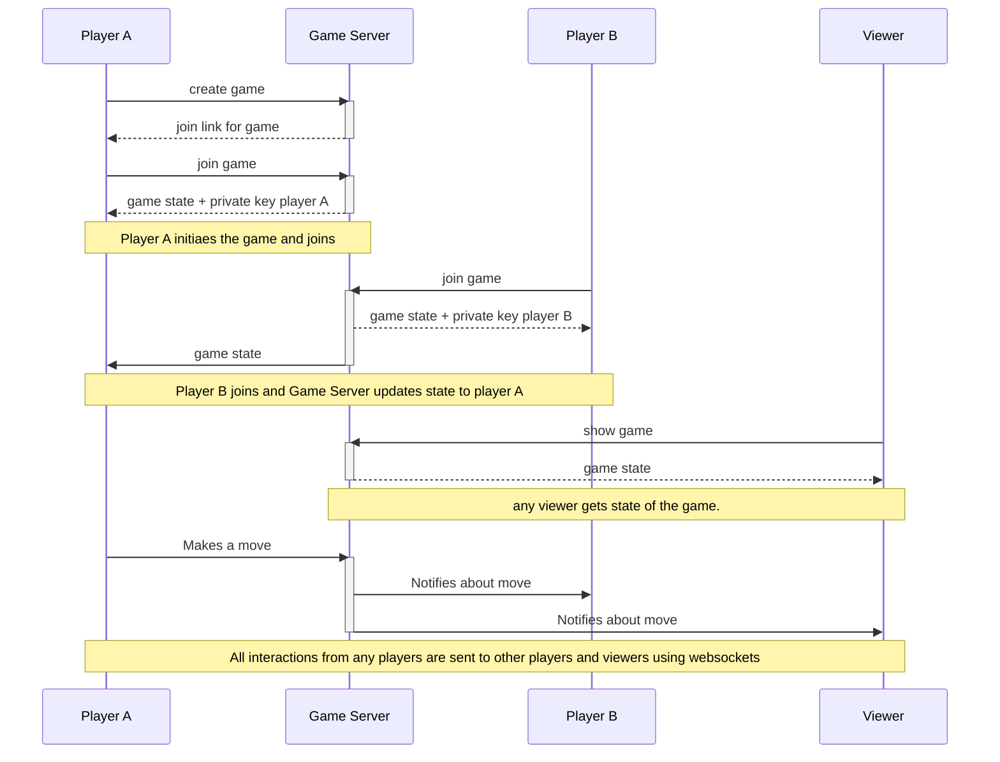
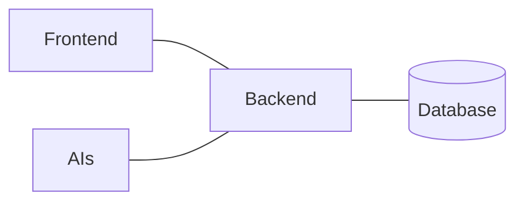

# Architecture

We want the following interaction between the client app (either AI or Human with a browser), to allow the following behavior:

```mermaid
sequenceDiagram    
    Player A->>Game Server: create game
    activate Game Server
    Game Server-->>Player A: join link for game
    deactivate Game Server
    Player A->>Game Server: join game 
    activate Game Server
    Game Server-->>Player A: game state + private key player A
    deactivate Game Server
    Note over Player A,Game Server: Player A initiaes the game and joins
    Player B->>Game Server: join game
    activate Game Server
    Game Server-->>Player B: game state + private key player B
    Game Server->>Player A: game state
    deactivate Game Server
    Note over Player B,Player A: Player B joins and Game Server updates state to player A
    Viewer->>Game Server: show game
    activate Game Server
    Game Server-->>Viewer: game state
    deactivate Game Server
    Note over Viewer, Game Server: any viewer gets state of the game.
    Player A->>Game Server: Makes a move
    activate Game Server
    Game Server->>Player B: Notifies about move
    Game Server->>Viewer: Notifies about move
    deactivate Game Server
    Note over Player A, Viewer: All interactions from any players are sent to other players and viewers using websockets
```

To achieve this we need the following componts:

```mermaid
flowchart LR
    Frontend --- Backend
    AIs --- Backend
    Backend --- Database[(Database)]
```